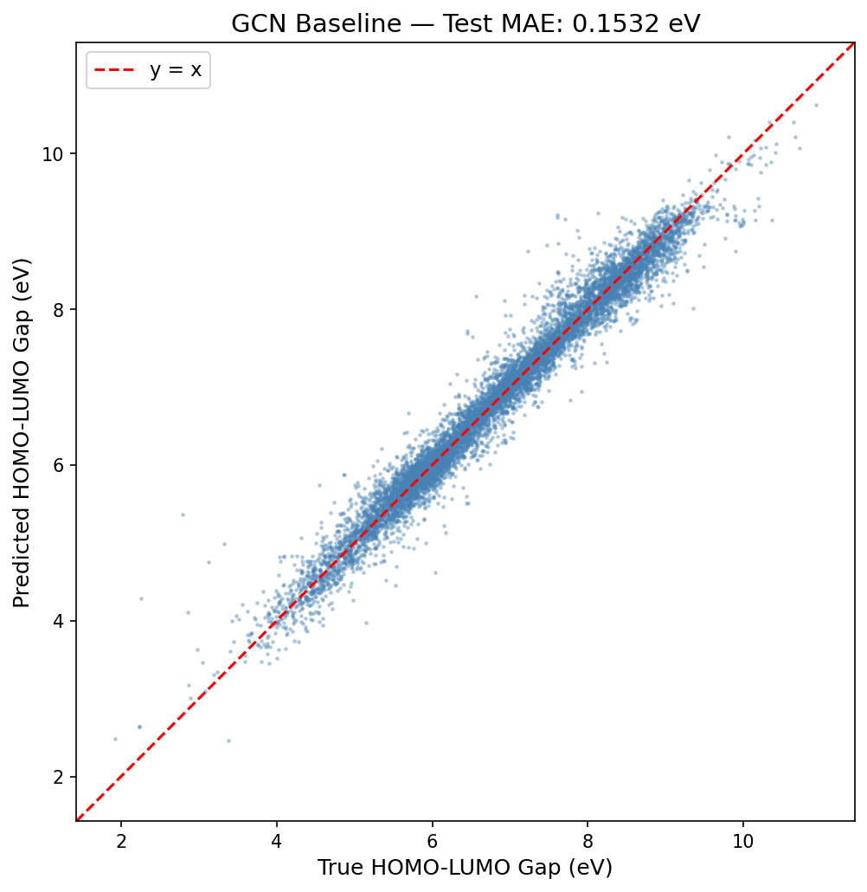
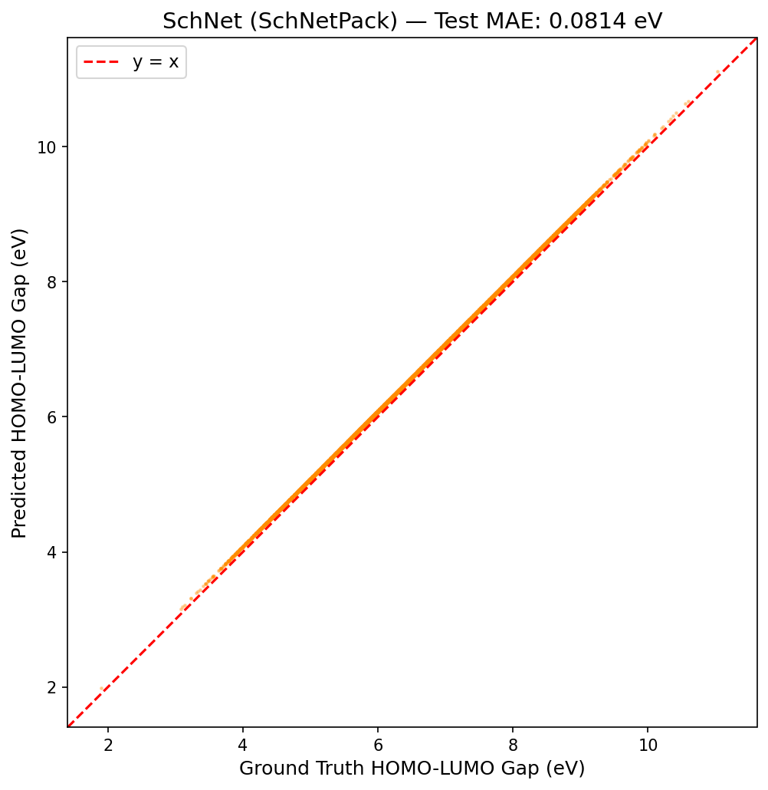
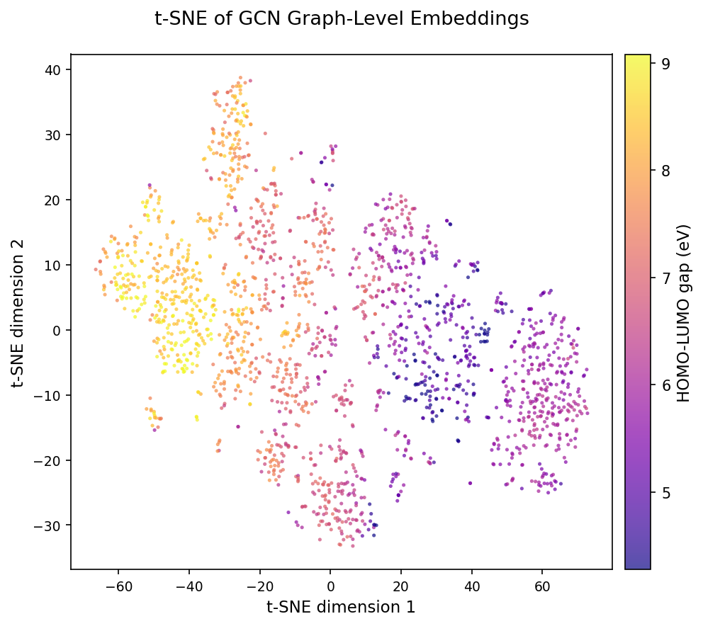
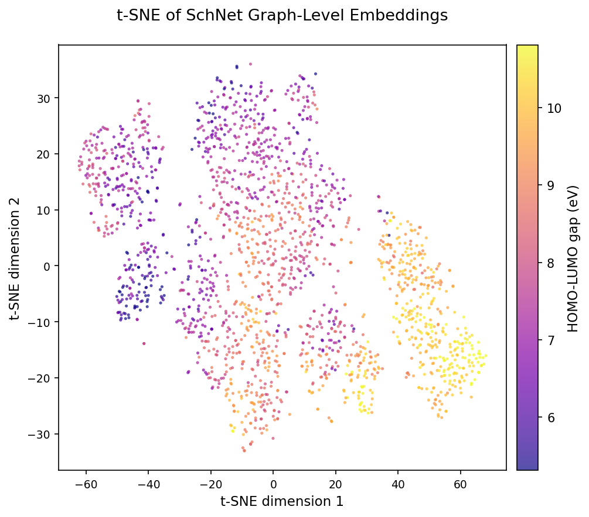

# 24-788 Mini-Project: QM9 HOMO-LUMO Gap Prediction

---

## Overview

This project predicts the **HOMO-LUMO gap** (target index 4, units: eV) of small organic molecules from the [QM9 dataset](https://pytorch-geometric.readthedocs.io/en/latest/generated/torch_geometric.datasets.QM9.html) using two graph neural network architectures:

| Model | Description | Test MAE (eV) |
|---|---|---|
| **GCN** (Baseline) | Graph Convolutional Network — bond topology only | 0.1532 |
| **SchNet** (Variant) | Continuous-filter CNN — 3D interatomic distances | 0.0814 |

The core hypothesis: **3D geometry encodes spatial orbital overlap information that topology-only GCN cannot capture**, yielding a substantial improvement in MAE.

---

## Repository Structure

```
24788-miniproject/
├── notebooks/
│   ├── train_gcn.ipynb          # GCN training pipeline (Colab-ready)
│   ├── train_schnet.ipynb       # SchNet training pipeline (Colab-ready)
│   └── t-sne_visualization.ipynb # t-SNE embedding analysis
├── figures/
│   ├── gcn_val_loss_plot.png
│   ├── gcn_pred_vs_true.png
│   ├── schnet_val_loss_plot.png
│   ├── schnet_pred_vs_true.png
│   ├── tsne_gcn.png
│   ├── tsne_schnet.png
│   └── tsne_comparison.png
└── README.md
```

---

## Models

### Baseline: Graph Convolutional Network (GCN)
- **Paper:** Kipf & Welling, "Semi-Supervised Classification with Graph Convolutional Networks", ICLR 2016 ([arXiv:1609.02907
](https://arxiv.org/abs/1609.02907))
- **Inputs:** Node features `data.x` [num_atoms, 11] + bond topology `data.edge_index`
- **Architecture:** InputProj → [GCNConv → BN → ReLU → Dropout] × 4 → GlobalMeanPool → MLP → scalar
- Uses **bond connectivity only** — no 3D coordinates

### Variant: SchNet
- **Paper:** Schütt et al., "SchNet: A continuous-filter convolutional neural network for modeling quantum interactions", NeurIPS 2017 ([arXiv:1706.08566](https://arxiv.org/abs/1706.08566))
- **Inputs:** Atomic numbers `data.z` + 3D coordinates `data.pos`
- **Architecture:** AtomEmbed → Gaussian RBF distance expansion → [ContinuousFilterConv] × 6 → SumPool → MLP → scalar
- Builds its own radius graph (cutoff ~10 Å) — **does not use bond topology**

### Contribution: t-SNE Embedding Visualization
- **t-SNE visualization:** Extract graph-level embeddings (pre-MLP) from both GCN and SchNet on the test set, project to 2D via t-SNE, and color by true HOMO-LUMO gap value
- Reveals whether SchNet learns a more geometrically structured latent space compared to the topology-only GCN

---

## Data Pipeline

```python
from torch_geometric.datasets import QM9

dataset = QM9(root='./data/QM9')

# Deterministic 110k / 10k / 10k split
torch.manual_seed(42)
perm = torch.randperm(len(dataset))
train_dataset = dataset[perm[:110000]]
val_dataset   = dataset[perm[110000:120000]]
test_dataset  = dataset[perm[120000:130000]]

# Target: column 4 = HOMO-LUMO gap (eV)
# Normalize with training mean/std; de-normalize before reporting MAE
```

---

## Training Configuration

| Setting | GCN | SchNet |
|---|---|---|
| Optimizer | Adam, lr=1e-3, wd=1e-5 | Adam, lr=5e-4, wd=0 |
| Scheduler | ReduceLROnPlateau (patience=10, factor=0.5) | same |
| Early stopping | patience=25 on val MAE | same |
| Batch size | 64 | 64 |
| Max epochs | 300 | 300 |
| Gradient clipping | max_norm=10.0 | max_norm=10.0 |

---

## Results

### Prediction Plots

| GCN | SchNet |
|---|---|
|  |  |

### t-SNE Embeddings

| GCN Embeddings | SchNet Embeddings |
|---|---|
|  |  |

---

## Running the Notebooks

The notebooks are designed for **Google Colab Pro** (T4 or L4 GPU). To run:

1. Open the notebook in Colab
2. Mount Google Drive for checkpoint persistence
3. Install dependencies (first cell in each notebook)
4. Set your W&B API key as `WANDB_API_KEY` in .env file

---

## References

1. Kipf & Welling (2016). Semi-Supervised Classification with Graph Convolutional Networks. *ICLR 2016*.
2. Schütt et al. (2017). SchNet: A continuous-filter convolutional neural network for modeling quantum interactions. *NeurIPS 2017*.
